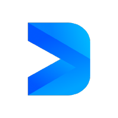

<!--
*** Thanks for checking out this README Template. If you have a suggestion that would
*** make this better, please fork the repo and create a pull request or simply open
*** an issue with the tag "enhancement".
*** Thanks again! Now go create something AMAZING! :D
-->


<!-- PROJECT SHIELDS -->
<!--
*** I'm using markdown "reference style" links for readability.
*** Reference links are enclosed in brackets [ ] instead of parentheses ( ).
*** See the bottom of this document for the declaration of the reference variables
*** for contributors-url, forks-url, etc. This is an optional, concise syntax you may use.
*** https://www.markdownguide.org/basic-syntax/#reference-style-links
-->
[![Contributors][contributors-shield]][contributors-url]
[![Forks][forks-shield]][forks-url]
[![Stargazers][stars-shield]][stars-url]
[![Issues][issues-shield]][issues-url]
[![MIT License][license-shield]][license-url]
[![LinkedIn][linkedin-shield]][linkedin-url]


<!-- PROJECT LOGO -->
<br />
<p align="center">
  <a href="https://github.com/DeverseSocial/deso_sdk">
    
  </a>

  <h3 align="center">DeSo Dart SDK</h3>

  <p align="center">
    Unofficial Dart SDK for Decentralized Social / DeSo.org
    <br />
    <br />
    <a href="https://github.com/DeverseSocial/deso_sdk/issues">Report Bug</a>
    ·
    <a href="https://github.com/DeverseSocial/deso_sdk/issues">Request Feature</a>
  </p>
</p>


<!-- TABLE OF CONTENTS -->
## Table of Contents

* [About the Project](#about-the-project)
  * [Built With](#built-with)
* [Getting Started](#getting-started)
  * [Prerequisites](#prerequisites)
  * [Installation](#installation)
* [Usage](#usage)
* [Roadmap](#roadmap)
* [Contributing](#contributing)
* [License](#license)
* [Contact](#contact)
* [Acknowledgements](#acknowledgements)


## About The Project

This is the 1st unofficial Dart SDK for DeSo. 

### EXAMPLE PROJECT SCREENSHOT

[![Playground Desktop App][screenshots-desktop]](https://github.com/DeverseSocial/deso_sdk)

### Supported Platforms
- iOS
- Android
- Mac OS
- Windows
- Linux
- Web

### Built With
Google Flutter SDK
* [Flutter](https://flutter.dev)


<!-- GETTING STARTED -->
## Getting Started


### Prerequisites

* [Flutter SDK](https://flutter.dev)
* [Android SDK & Android Studio](https://developer.android.com/studio) for deployment to Android
* [XCode IDE](https://developer.apple.com/xcode/) for deployment to iOS/iPad/MacOS
* [VS Code IDE](https://code.visualstudio.com/) optional

### Installation

1. Clone the repo
```sh
git clone https://github.com/DeverseSocial/deso_sdk.git
```
2. Install packages dependencies
```
flutter pub get
```
3. Run
```
flutter run
```


<!-- USAGE EXAMPLES -->
## Usage

// Instantiate DeSo SDK Object
final deso = Deso();

// Optional - Set DeSo Node host
deso.client.init(
  host: 'diamondapp.com',
  apiVersion: 0,
);

debugPrint('requesting...');
final result = await deso.general.appState();

result.fold(
  (apiError) {
    // ERROR
    final text = apiError.toJson().toString();
    debugPrint(text);
  },
  (object) {
    // SUCCESS
    final text = object.toJson().toString();
    debugPrint(text);
  },
);

debugPrint('request done');

<!-- ROADMAP -->
## Roadmap

* Complete API
* Unit Testing

See the [open issues](https://github.com/DeverseSocial/deso_sdk/issues) for a list of proposed features (and known issues).


<!-- CONTRIBUTING -->
## Contributing

Contributions are what make the open source community such an amazing place to be learn, inspire, and create. Any contributions you make are **greatly appreciated**.

1. Fork the Project
2. Create your Feature Branch (`git checkout -b feature/AmazingFeature`)
3. Commit your Changes (`git commit -m 'Add some AmazingFeature'`)
4. Push to the Branch (`git push origin feature/AmazingFeature`)
5. Open a Pull Request


<!-- LICENSE -->
## License
 
Distributed under the MIT License. See `LICENSE` for more information.


<!-- CONTACT -->
## Contact

Oliver Martinez - [@nemoryoliver](https://twitter.com/nemoryoliver) - nemoryoliver@gmail.com

Project Link: [https://github.com/DeverseSocial/deso_sdk](https://github.com/DeverseSocial/deso_sdk)


<!-- ACKNOWLEDGEMENTS -->
## Acknowledgements
* [DeSo](https://deso.org)
* [BitClout](https://bitclout.com)
* [DiamondApp](https://diamondapp.com)


<!-- MARKDOWN LINKS & IMAGES -->
<!-- https://www.markdownguide.org/basic-syntax/#reference-style-links -->
[contributors-shield]: https://img.shields.io/github/contributors/DeverseSocial/deso_sdk.svg?style=flat-square
[contributors-url]: https://github.com/DeverseSocial/deso_sdk/graphs/contributors
[forks-shield]: https://img.shields.io/github/forks/DeverseSocial/deso_sdk.svg?style=flat-square
[forks-url]: https://github.com/DeverseSocial/deso_sdk/network/members
[stars-shield]: https://img.shields.io/github/stars/DeverseSocial/deso_sdk.svg?style=flat-square
[stars-url]: https://github.com/DeverseSocial/deso_sdk/stargazers
[issues-shield]: https://img.shields.io/github/issues/DeverseSocial/deso_sdk.svg?style=flat-square
[issues-url]: https://github.com/DeverseSocial/deso_sdk/issues
[license-shield]: https://img.shields.io/github/license/DeverseSocial/deso_sdk.svg?style=flat-square
[license-url]: https://github.com/DeverseSocial/deso_sdk/blob/master/LICENSE.txt
[linkedin-shield]: https://img.shields.io/badge/-LinkedIn-black.svg?style=flat-square&logo=linkedin&colorB=555
[linkedin-url]: https://linkedin.com/in/nemoryoliver
[screenshots-desktop]: images/screenshots_desktop.png
